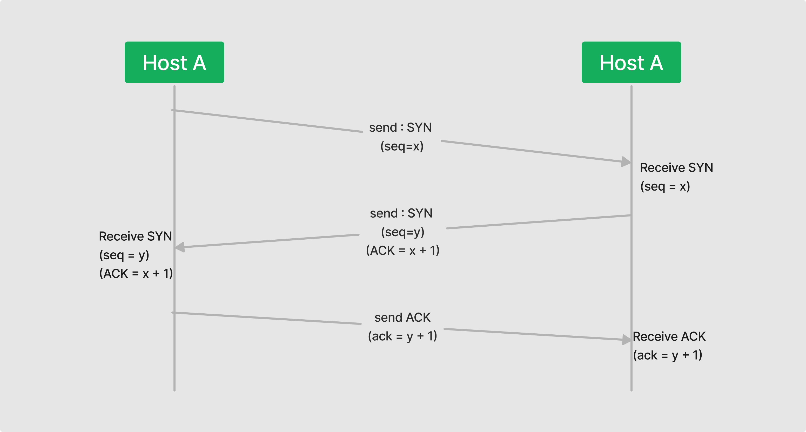
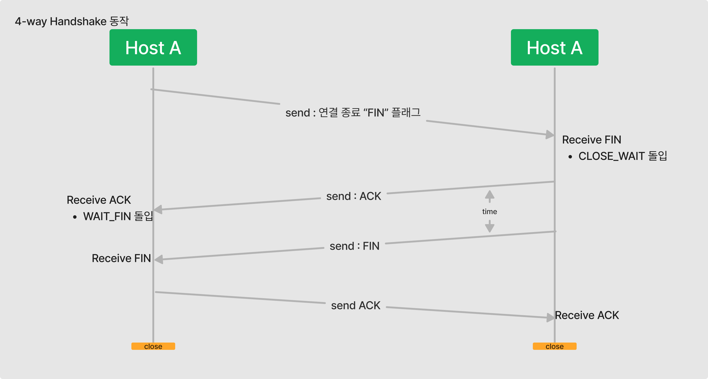
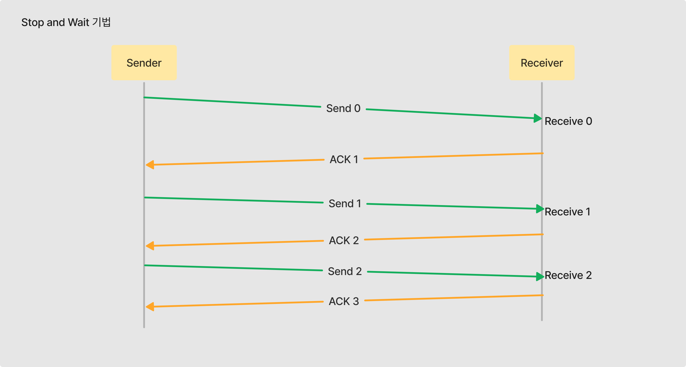
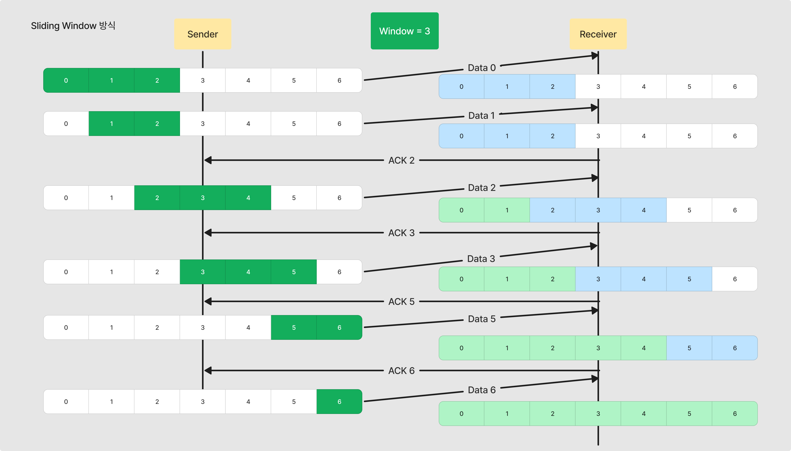
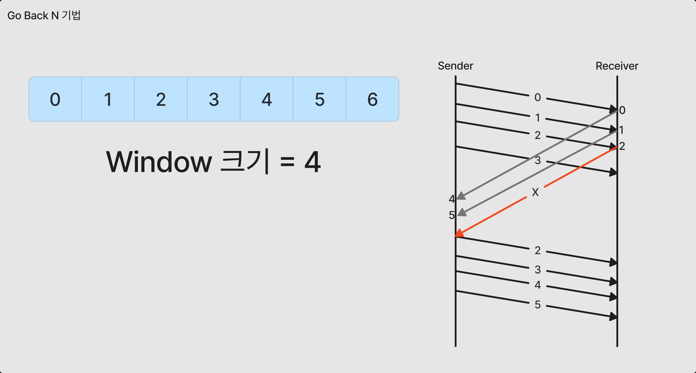
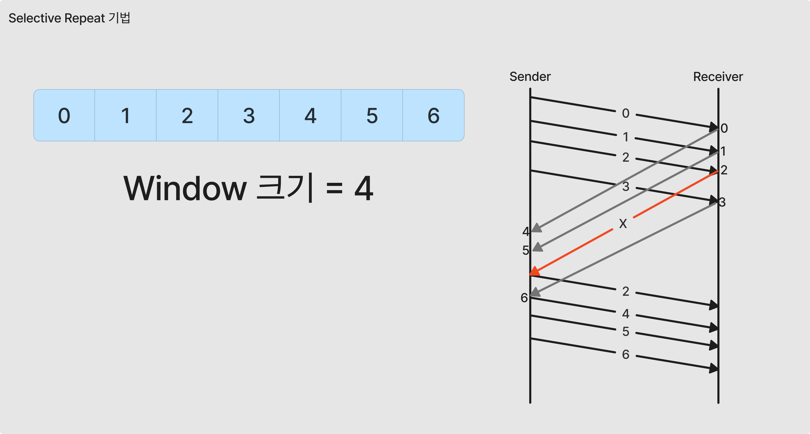

[Youtube : 이해하면 인생이 바뀌는 TCP 송/수신 원리 ](https://www.youtube.com/watch?v=K9L9YZhEjC0)

- 위의 영상을 보시면 TCP의 기본 흐름을 이해하기 훨씬 수월합니다.
- 위의 영상을 시청하신 후, 다음 글을 보는 것을 추천드립니다.

### TCP 란 무엇인가?

- TCP 는 IP 위에서 동작하는 프로토콜
- 데이터의 전달을 **보증** 하고 보낸 순서대로 수신할 수 있게 해주는 **신뢰성 연결** 이다.
- OSI 7 Layer 상의 4계층인, Transport Layer에 해당 한다.
    - 사용자간의 연결을 생성, 데이터 송/수신에 대한 검증을 담당한다.

## TCP 의 동작

TCP는 데이터의 정확한 전송을 보장 하기 위해 특정 동작을 수행한다.

논리적인 접속을 성립하기 위한 동작과, 통신 종료를 위한 동작을 수행한다.

1. 3-way handshake
2. 4-way handshake

### 3-way handshake

1. Host A 가 Host B 에게 **SYN(x) 패킷**을 전송한다 (sequence = x)
2. Host B 가 SYN 을 받고, 정상 수신 신호인 **ACK(y)**와 **SYN(y+1) 패킷**을 Host A 로 전송한다.
3. Host A 는 Host B 로 부터 ACK(y) 와 **SYN(y+1)** 패킷을 받고, **ACK(y+1)** Host B로 전송한다.

위의 3번의 통신을 거쳐 Host(application, Client - server) 간의 연결을 성립한다.

### 4-way Handshake

1. Host A 는 Host B에게 연결을 종료한다는 flag 인 **FIN** flag를 전송한다.
2. Host B 는 FIN flag를 수신하고, 확인의 ACK 를 Host A에게 전송한다.
    1. CLOSE_WAIT 상태로 돌입한다.
3. Host B 는 종료 준비를 끝낸 후, Host A에게 **FIN** flag를 전송한다.
4. Host A는 **FIN** flag 를 수신 한 후, 종료 준비가 다 되었다는 **ACK** 를 Host B 에게 전송한다.
    1. Host A 는 이 후 TIME_WAIT 상태로 돌입한다.
5. Host B 는 Host A 의 종료 ACK 를 수신 후, close 된다.
6. TIME_WAIT 상태를 거친 후, Host A도 close 된다.

위의 과정을 통해 TCP 로 연결이 성립된 두 Application(Host - Host) 간의 연결이 종료 된다.

### TCP의 신뢰성 보장 방법

TCP 통신은 위에서 기술한 3-way Handshake를 통해 각 송/수신 주체 간의 연결을 활성화 하고

**패킷** 을 서로에게 전송하며 데이터를 전송한다.

이때, 송신 속도와 수신 속도의 차이가 발생 할 때, 수신측의 저장용량 초과가 발생 할 때, 도착하는 패킷의 완전성을 보장 할 수 없게 된다.

이를 위해 TCP 는 **흐름제어** 를 통해 송신측과 수신측의 데이터 생성률과 소비율의 균형을 맞춘다.

이는 **TCP 버퍼** 를 이용하여 수행된다.

## TCP 의 흐름제어

- TCP 버퍼
    - 송신측, 수신측 데이터를 저장하기 위해 모두 가지고 있다.
    - 송신측은 버퍼에 TCP 세그먼트를 보관 한 후, 순차적으로 전송한다.
    - 수신측은 수신한 TCP 세그먼트를 수신 후, 애플리케이션의 처리가 발생할 때 까지 버퍼에 보관한다.

- 흐름제어 : 송신측과 수신측의 데이터 처리 속도 차이를 해결하기 위한 기법

송신측과 수신측의 데이터 처리 속도의 차이가 발생하는 주된 원인은 버퍼가 원인이다.

송신 측이 데이터를 전송하면, 수신측은 이를 수신하여, 수신측 버퍼에 저장한 후 처리하게 되는데

이 때, 수신측이 버퍼에 있는 정보를 처리하기 전에 송신측에서 더 빠른 속도로 다음 데이터를 전송 하는 속도가 더 빠르다면, 

결국 수신측의 버퍼가 전부 차버릴 것이기에, 이후 수신하게 되는 데이터(패킷)은 손실가능성이 크다.

이로 인해 불필요한 추가 패킷 전송이 발생할 수 있다.

이를 방지하기 위해 송신측은 수신측의 데이터 처리 속도를 인지할 필요가 있다.

수신측의 피드백을 통해, 송신측은 데이터 전송 속도를 조절 할 수 있도록 하는 기법이

**흐름제어** 기법이다.  

### Stop And Wait 기법

- 매번 전송한 데이터에 대한 수신완료 응답을 받은 다음, 다음 데이터를 전송하는 방법
    
    
    

1. 송신측에서 0번째 데이터를 수신측에 전송한다.
2. 수신측은 송신측 에서 0번째 데이터를 받은 뒤, 다음 데이터 번호와 함께 송신측에 수신완료 데이터를 전송한다.
3. 송신측이 수신측의 수신완료 데이터 및 다음 데이터 번호를 받고, 바로 다음 데이터를 수신측에 전송한다.

Stop and Wait 기법은 위와 같은 flow로 동작한다.

안정성은 충분히 보장할 수 있으나, 패킷 데이터를 1개씩 전송하므로 속도에 대한 한계성이 존재한다.가장 큰 문제점은, 송신측이 수신측의 수신완료 응답을 받기 위해 TIME_WAIT 와 같은 상태에 돌입하는데,

TIME_OUT이 발생할 경우, 전송한 데이터가 손실됐다고 판단하여, 재전송을 수행한다.

이로 인해 중복된 전송 프레임이 발생할 수 있다.

현대에서는 쓰지 않는 기법이다.

### Sliding Window 기법

- Stop and Wait 기법의 비효율성을 보완한 방식
- 송신측이 수신확인 응답을 기다리는 동안, 한 개 이상의 데이터(패킷)을 전송하여 채널의 전송 효율을 높인 방식
- 수신측에서 3-way handshake 단계에서 지정한 **Window** 크기에 따라 송신측이 지정한 크기의 데이터를 전송한다.

- 동작 방식
1. 송신측은 지정된 윈도우 크기 만큼 데이터를 전송하고 ACK를 기다린다.
2. 송신측이 ACK를 받으면, 받은 ACK 만큼 윈도우 를 이동하고, 해당 윈도우 크기 만큼의 데이터를 다시 수신측에 전송한다.
3. 수신측은 데이터를 받고, 다음 전송을 요청할 번호를 ACK 에 담아 송신측에 전달한다.
4. 송신측은 다시 ACK로 넘겨받은 숫자만큼 윈도우를 이동하고, 해당 범위의 데이터를 다시 수신측에 전송한다.

### Go Back N

- 패킷을 전송할 때, 수신측에서 잘못 받은 것이 있거나, 못 받은 데이터가 존재하는 경우에
    
    해당하는 패킷 번호 부터 **다시 재전송** 을 하는 기법
    
- 수신측의 동작을 단순히 하기 위해, 모든 복사본을 재전송
- 단점 : 성공적으로 전송된 데이터까지 재전송하므로, 네트워크 자원을 낭비 한다.

위의 과정에서 간단히 Go-Back-N 방식의 송/수신 흐름을 그려보았는데,

쉽게 알 수 있는 것은, 2번 데이터의 수신이 실패 하였을 때,

앞서 전송에 성공했다고 판단된 3번 까지 포함하여 지정한 윈도우 크기 만큼 2부터 다시

데이터를 송신한다.

즉, Go-Back-N 방식은 손실된 패킷 + 그 이후의 윈도우 크기에 맞는 데이터 를 다시 재전송하는

방식이다.

### Selective Repeat

Go-Back-N 방식을 보완한 방식으로

Go-Back-N 은 손실된 데이터의 위치부터 이미 전송 성공한 데이터 일지라도

윈도우 크기만큼 재전송 한다면,

Selective Repeat 방식은 전송이 실패한 데이터(손실된 패킷)만

재전송 하는 방식이다.

지정한 데이터만 재전송 하는 방식이기 때문에, Go-Back-N 과 다르게 별도의 데이터 재정렬을 수행해야 하는데, 이를 위한 별도의 **버퍼**를 필요로 한다

위 상황에서 알 수 있듯, 2번 데이터에 대한 전송이 실패 했을 때,

다음 전송부터 Go-Back-N 기법처럼 이미 보낸 데이터를 재전송 하는 것이 아닌

**오류가 발생한 패킷만 재전송** 하고, 이후의 데이터는 기존의 흐름과 동일하게 전송한다.

## TCP 혼잡제어

네트워크 혼잡의 발생을 방지하기 위한 제어 기법이다.

네트워크 혼잡은 여러가지 이유로 발생할 수 있는데,

대표적으로 아래의 경우가 존재한다.

1. 네트워크가 감당하기에는 많은 양의 데이터를 너무 빠르게 전송하는 상황
2. 라우터가 데이터를 처리하는 속도보다 많은 양의 데이터가 들어오는 경우
    - 해당 과정에서 손실된 데이터에 대해 재전송이 발생하는데, 이것이 쌓여 혼잡을 발생시킨다.

혼잡제어 방식에는 대표적으로 방식 몇가지가 존재 한다.

1. AIMD
2. Slow Start
3. Fast Retransmit
4. Fast Recovery

### AIMD

Additive Increase / Multicative Decrease : 합증가 / 곱감소

- 처음 패킷을 한개씩 보내고, 전송이 올바르게 수행 되면, window의 크기를 1씩 증가시키며 전송한다.
- 패킷 전송 실패 시, 일정시간이 경과하면 패킷 전송 속도를 절반으로 감소 시킨다.
- window의 크기를 소량 증가 시키기 때문에, 초반 네트워크 진입시 모든 대역 활용을 이용한 통신까지 다소 시간이 소요된다.

### Slow Start

- AIMD 방식과 같이 패킷을 한 개 씩 보내고, 전송 성공 시, 각각의 ACK 패킷 마다  window의 크기를 1씩 증가 시킨다.
- 혼잡 현상 발생 시, window 크기를 1로 감소 시킨다.

### Fast Retransmit

- 수신측에서, 먼저 도착할 패킷이 도착하지 않고 다음 패킷이 도착한 경우에도 ACK 패킷을 전송한다.
- 정상 순서대로 도착한 마지막 패킷의 순번을 ACK 에 담아 보내며, 이것이 3번 중복 되면
해당 패킷 순번 + 1 의 패킷 을 재전송한다.

### Fast Recovery

- 혼잡 상황 발생 시, window의 크기를 1로 줄이지 않고 절반으로 감소 시켜 선형증가 시키는 방식

## 총정리

### 요약

TCP를 이용해, Host 간 통신 시 적용되는 여러 기법 (흐름제어, 오류제어) 를 알아보았다.

기본적으로 TCP는 **신뢰성있는 연결을 보장** 하기 위해 여러 장치가 되어 있는데

그 중 대표적으로 3-way Handshake, 4-way Handshake로 연결/해제에 대한 신뢰 자체를 보장하고 시작/종료 한다.

3 way handshake 단계에서, 송/수신 Host의 연결이 활성화되고, 4 way handshake 단계를 통해 안전한 연결 해제를 진행한다.

실제 데이터의 송/수신이 일어나는 단계에서는 신뢰성을 보장 하기 위해 패킷 손실에 대한 방지 대책으로 흐름제어 기법 몇개가 존재 하는데, 다음과 같다.

1. Stop and wait
2. Sliding Window를 활용한 Go Back N
3. Sliding Window 를 활용한 Selective Repeat

위의 기법을 통해 송 ↔ 수신 간의 전송 속도 불균형을 제어한다.

네트워크 단계에서 송↔ 수신간의 데이터 처리 속도의 차이를 방지하기 위해서는

혼잡제어 기법이 존재하는데, 다음의 주요 4가지 기법을 사용한다.

1. AIMD
2. Slow Start
3. Fast Retransmit
4. Fast Recovery

위의 흐름제어, 혼잡제어 방식을 통해 비신뢰성 연결인 IP 위에서 신뢰성 있는 연결을 보장한다

### 느낀점

평소 사용하는 인터넷에서 위의 정리한 내용들이 복합적으로 이루어지고 있는 것이 흥미로웠다.

실제 사용자인 “나” 는 OSI 계층의 7번째 계층인 Application 계층에서 일어나는 현상만 시각적으로

확인할 수 있으므로, 접속하는 사이트가 어떤 통신 방식을 통해 데이터를 **온전히** 송/수신 하는지

이번 기회에 확실히 알 게 되었다.

해당 과제를 통해, 인터넷 사용 시, 개발자 도구의 Network 탭에서 발생하는 일련의 데이터 송/수신이

어떻게 발생하는지 추상적으로 이해할 수 있게 되었다.

### 참고

- [TCP : 위키피디아](https://ko.wikipedia.org/wiki/전송_제어_프로토콜)
- [TCP : 토스 페이먼츠](https://docs.tosspayments.com/resources/glossary/tcp)
- [RFC 9293](https://datatracker.ietf.org/doc/html/rfc9293)
- [Tech Interview 블로그](https://gyoogle.dev/blog/computer-science/network/%ED%9D%90%EB%A6%84%EC%A0%9C%EC%96%B4%20&%20%ED%98%BC%EC%9E%A1%EC%A0%9C%EC%96%B4.html)
- [Young 블로그](https://young1403.tistory.com/86)